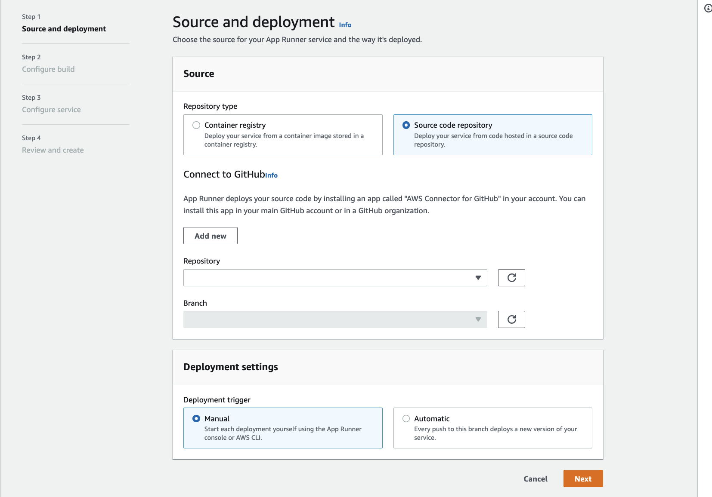
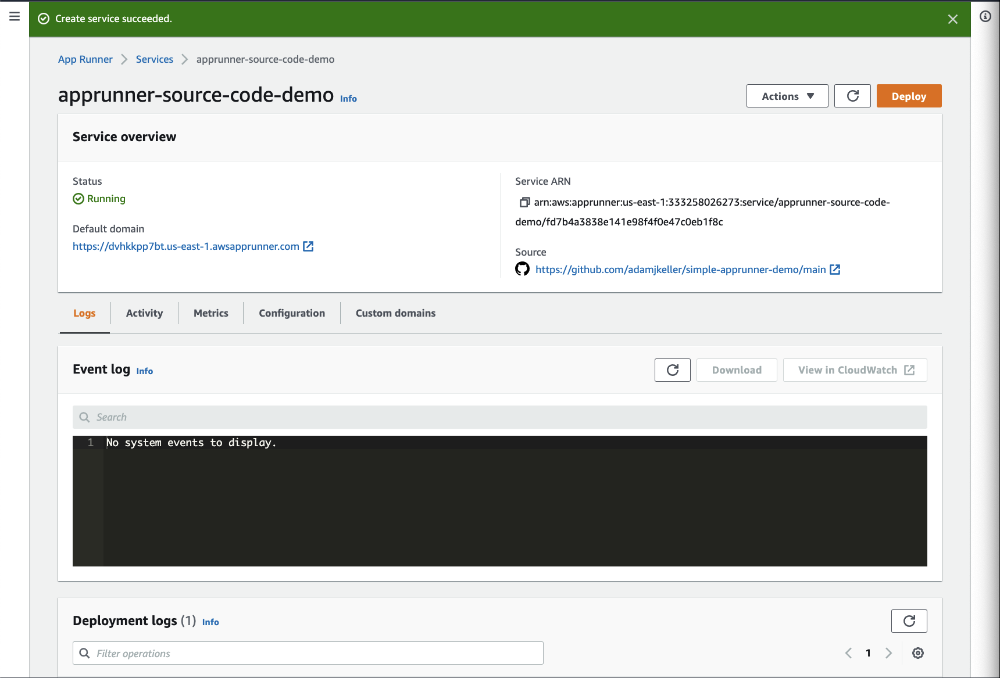
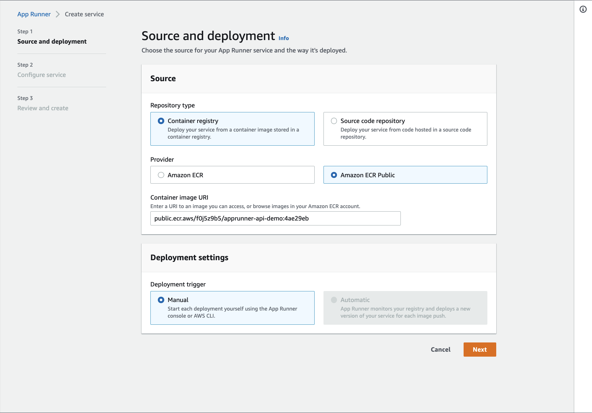
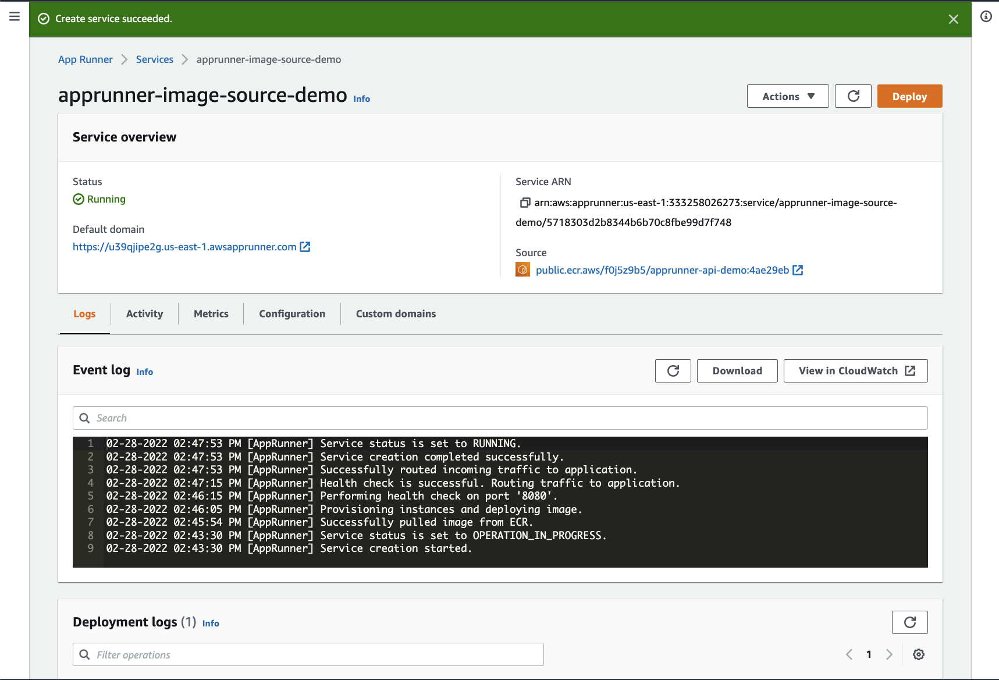

# Simple App Runner Demo

## Walkthrough

1. In this walkthrough we will take an API written in Python and deploy it to AWS App Runner as a public facing API.

2. With App Runner, we have two options for getting our application running in a managed environment serving traffic:

- Deploy a source code based service. With a source code based service, you point App Runner to a source code repository and choose the runtime that corresponds to the programming language used.
- Deploy an image based service. With this approach, you point App Runner to the source container image and App Runner will run the service from that container image.

> **_NOTE:_** Regardless of the source type, App Runner takes care of starting, running, scaling, and load balancing your service. You can use the CI/CD capability of App Runner to track changes to your source image or code. When App Runner discovers a change, it automatically builds (for source code) and deploys the new version to your App Runner service.

3. Follow the path that you'd wish to continue with below.

### Source Code Based Service

<details><summary> Click to Expand! </summary>

1. Let's start by navigating to the AWS App Runner [Console](https://console.aws.amazon.com/apprunner/home).

2. Next, select "Create an App Runner service"


3. The first step is to choose what our source will be, and how we want deployments to be triggered (manual or automatic).



4. Navigate to github and fork this [repo](https://github.com/adamjkeller/simple-apprunner-demo) as this will be the source code repository that we will deploy from.
   For more information on how to fork a repo, check out the [documentation](https://docs.github.com/en/get-started/quickstart/fork-a-repo).

5. Head back to the App Runner console, and choose `Source code repository`.

6. Next, we need to setup a connection to GitHub.
   This will allow the App Runner service to communicate with GitHub to pull down the source code.
   Click `Add new`, and follow the steps to create the connection.
   Once done, come back here and let's select the repo.

7. Under `Connect to GitHub`, do the following:

- Choose the connection that you just created
- Select the repository that you forked (simple-apprunner-demo)
- Choose main for the branch

8. The deployment settings are where we can select the deployment mechanism for our App Runner service. Once you select, click Next.

- Automatic will enable continuous deployment every time a commit is pushed to the main branch.
- Manual will require the user to trigger a deployment via the console or AWS CLI. (Note that there is a fee associated with automated deployments, please see the pricing docs for more details.)

9. Step 2 prompts us to make a decision on where we want the build configuration to live.
   We can either create it in the console, or define it in a yaml file stored in our git repository.
   The build configuration is where we specify the runtime (Java, Python, Nodejs), the build command, and finally the command to start the application.
   For this walkthrough, we will define the configuration in the console.
   Follow the steps below:

   a. Runtime: Choose `Python3`

   b. Build command: `pip install -r requirements.txt`

   c. Start command: `uvicorn --host 0.0.0.0 --port 8080 --log-level info main:app`

   d. Port: `8080`

   Alternatively, as mentioned above we can define this in a yaml file. Here's what that would look like:

   ```yaml
   version: 1.0
   runtime: python3
   build:
   commands:
     build:
       - pip install -r requirements.txt
   run:
   runtime-version: 3.8
   command: uvicorn --host 0.0.0.0 --port 8080 --log-level info main:app
   network:
     port: 8080
   ```

10. In step 3, we get to configure our service to serve our applications needs.
    While there are quite a few options here, we are only going to modify the service settings and stick with defaults for the rest.
    For service settings, do the following:

    a. Service name: `apprunner-source-code-demo`

    b. Virtual CPU & memory: Stick with the defaults

    c. Environment Variables: Click `Add environment variable`, for Key type `DEMO_ENV_VAR`, and for value type `I deployed this service using my source code!`.

    For more information on the other configuration options, see below:

    - Service settings: Set the name of the service as well as cpu/memory requirements and any environment variables to expose to the container at runtime.
    - Auto Scaling: Configure the scaling behavior of the application, this includes the number of concurrent requests to trigger auto scaling, and minimum/maximum instances to launch in response.
    - Health check: Set the thresholds and intervals for health checking the service.
    - Security:
      - Instance role: Set the IAM role to attach to our App Runner instances, which will enable the application to make AWS API calls defined in the role policies.
      - AWS KMS key: Choose either an AWS-owned key or a key that you manage in AWS KMS to encrypt the source code at rest.
    - Networking: If the service needs to communicate (egress) with services, databases, etc that reside in a VPC, you can choose `Custom VPC` and configure that connection.
    - Tags: Tag the App Runner services for cost, understanding of resources.

11. Once you've configured the service settings, scroll to the bottom of the page and click Next.
    Feel free to review the configuration, and when done click `Create & Deploy`.

12. That's it! Keep an eye on the deployment process and once it's done, navigate to the URL provided on the service overview page under `default domain` and you should see the app up and running!



13. Feel free to navigate around and review the different features for the service.
    In the console we can find the following:

##### Logs

- Event log: The event log shows all events related to your app runner service. Note that this is not where your application logs live.
- Deployment logs: The build and deployment outputs are logged here. Good for troubleshooting build issues.
- Application logs: All of the stderr/stdout logging for your application will fall under Application logs. This is where you will troubleshoot application related issues post deployment.

##### Activity

View your service activity -— a journal of operations like service creation, repository deployment, and service pause.

An App Runner service is a running version of your web application.

Things you can do here:

- See a list of service operations, their time range, and their current (or final) status.
- Find operations by entering a search term to scope down the list.
- Choose any listed operation to see or download its log.

##### Metrics

Track metrics related to the entire App Runner service (as opposed to detailed Instance metrics).

An App Runner service is a running version of your web application.

Things you can do here:

- See HTTP connection and request metrics for your web application.
- Track changes in the number of used and unused instances.
- Choose Add to dashboard or use the menu on a specific graph to go to the CloudWatch console for further analysis.

##### Configuration and Custom Domains

Configuration shows all of the current settings configured for your service. This is where you can make any changes if needed.
If you want to have a custom domain for your service (for example api.example.com), the custom domain section is where you can set this up.

</details>

### Source Image Based Service

<details><summary> Click to Expand! </summary>

1. Let's start by navigating to the AWS App Runner [Console](https://console.aws.amazon.com/apprunner/home).

2. Next, select "Create an App Runner service"


3. The first step is to choose what our source will be, and how we want deployments to be triggered (manual or automatic).
   We have a choice of which registry we want to use as our image provider: Amazon ECR and Amazon ECR Public.
   Go ahead and select Amazon ECR Public, and in the Container image URI field, add the following:

- `public.ecr.aws/f0j5z9b5/apprunner-api-demo:4ae29eb`

- Note that we can not enable automated deployments for public images.
  If you use a private image in ECR, you need to add a service role to allow App Runner to pull the image on your behalf, and then you can choose to have automated or manual deployments.

- Click Next.



4. Since we are managing the build of the docker image outside of App Runner, we don't have to create a build configuration and will be proceeding to configuring the service.

5. In step 2, we get to configure our service to serve our applications needs.
   While there are quite a few options here, we are only going to modify the service settings and stick with defaults for the rest.
   For service settings, do the following:

   a. Service name: `apprunner-image-source-demo`

   b. Virtual CPU & memory: Stick with the defaults

   c. Environment Variables: Click `Add environment variable`, for Key type `DEMO_ENV_VAR`, and for value type `I deployed this service using a Docker image!`.

   For more information on the other configuration options, see below:

   - Service settings: Set the name of the service as well as cpu/memory requirements and any environment variables to expose to the container at runtime.
   - Auto Scaling: Configure the scaling behavior of the application, this includes the number of concurrent requests to trigger auto scaling, and minimum/maximum instances to launch in response.
   - Health check: Set the thresholds and intervals for health checking the service.
   - Security:
     - Instance role: Set the IAM role to attach to our App Runner instances, which will enable the application to make AWS API calls defined in the role policies.
     - AWS KMS key: Choose either an AWS-owned key or a key that you manage in AWS KMS to encrypt the source code at rest.
   - Networking: If the service needs to communicate (egress) with services, databases, etc that reside in a VPC, you can choose `Custom VPC` and configure that connection.
   - Tags: Tag the App Runner services for cost, understanding of resources.

6. Once you've configured the service settings, scroll to the bottom of the page and click Next.
   Feel free to review the configuration, and when done click `Create & Deploy`.

7. That's it! Keep an eye on the deployment process and once it's done, navigate to the URL provided on the service overview page under `default domain` and you should see the app up and running!



13. Feel free to navigate around and review the different features for the service.
    In the console we can find the following:

##### Logs

- Event log: The event log shows all events related to your app runner service. Note that this is not where your application logs live.
- Deployment logs: The build and deployment outputs are logged here. Good for troubleshooting build issues.
- Application logs: All of the stderr/stdout logging for your application will fall under Application logs. This is where you will troubleshoot application related issues post deployment.

##### Activity

View your service activity -— a journal of operations like service creation, repository deployment, and service pause.

An App Runner service is a running version of your web application.

Things you can do here:

- See a list of service operations, their time range, and their current (or final) status.
- Find operations by entering a search term to scope down the list.
- Choose any listed operation to see or download its log.

##### Metrics

Track metrics related to the entire App Runner service (as opposed to detailed Instance metrics).

An App Runner service is a running version of your web application.

Things you can do here:

- See HTTP connection and request metrics for your web application.
- Track changes in the number of used and unused instances.
- Choose Add to dashboard or use the menu on a specific graph to go to the CloudWatch console for further analysis.

##### Configuration and Custom Domains

Configuration shows all of the current settings configured for your service. This is where you can make any changes if needed.
If you want to have a custom domain for your service (for example api.example.com), the custom domain section is where you can set this up.

</details>
